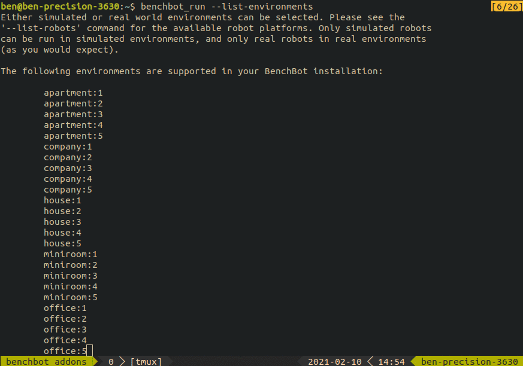

**NOTE: this software is part of the BenchBot software stack, and not intended to be run in isolation (although it can be installed independently through pip if desired). For a working BenchBot system, please install the BenchBot software stack by following the instructions [here](https://github.com/qcr/benchbot).**

# BenchBot Add-ons Manager

[](http://benchbot.org)
[](https://qcr.github.io)

[](./LICENSE.txt)



The BenchBot Add-ons Manager allows you to use BenchBot with a wide array of additional content, and customise your installation to suite your needs. Semantic Scene Understanding not your thing? Install the Semantic Question Answering add-ons instead. Want to create your own content? Write some basic YAML files to make your own add-ons. Need to re-use existing content? Simply include a dependency on that add-on. Add-ons are all about making BenchBot whatever you need it to be&mdash;build a BenchBot for your research problems, exactly as you need it.

Add-ons come in a variety of types. Anything that you may need to customise for your own experiments or research, should be customisable through an add-on. If not, let us know, and we'll add more add-on enabled functionality to BenchBot!

The list of currently supported types of add-ons are:

- **batches**: a list of environments used for repeatable evaluation scores with the `benchbot_batch` script.
- **environments**: simulated or real world environments that a task can be performed in, with a robot. Only [Isaac Sim](https://developer.nvidia.com/Isaac-sim) simulation is currently supported, but there is capacity to support other simulators. Please get in contact if you'd like to see another simulator in BenchBot!
- **evaluation_methods**: a method for evaluating a set of formatted results, against a corresponding ground truth, and producing scores describing how well a result performed a given task.
- **formats**: formalisation of a format for results or ground truth data, including helper functions.
- **ground_truths**: ground truth data in a declared format, about a specific environment. Environments can have many different types of ground truths depending on what different tasks require.
- **robots**: a robot definition declaring the communication channels available to the BenchBot ecosystem. Both simulated and real world robots are supported, they just need to run ROS.
- **tasks**: a task is a definition of something we want a robot to do, including what observations and actions it has available, and how results should be reported.

See the sections below for details of how to interact with installed add-ons, how to create your own add-ons, and formalisation of what's required in an add-on.

## Installing and using the add-ons manager

In general, you won't use the add-ons manager directly. Instead you interact with the [BenchBot software stack](https://github.com/qcr/benchbot), which uses the add-ons manager to manage and access add-ons.

The manager is a Python package if you do find you want to use it directly, and installable with pip. Run the following in the root directory where the repository was cloned:

```
u@pc:~$ pip install .
```

The manager can then be imported and used to manage installation, loading, accessing, processing, and updating of add-ons. Some samples of supported functionality are shown below:

```python
from benchbot_addons import manager as bam

# Check if example with 'name' = 'hello_scd' exists
bam.exists('examples', [('name', 'hello_scd')])

# Find all installed environments
bam.find_all('environments')

# Get a list of the names for all installed tasks
bam.get_field('tasks', 'name')

# Get a list of (name, variant) pairs for all installed environments
bam.get_fields('environments', ['name', 'variant'])

# Find a robot with 'name' = 'carter'
bam.get_match('robots', [('name', 'carter')])

# Get the 'results_format' value for the task called 'scd:passive:ground_truth'
bam.get_value_by_name('tasks', 'scd:passive:ground_truth', 'results_format')

# Load YAML data for all installed ground truths
bam.load_yaml_list(bam.find_all('ground_truths', extension='json'))

# Install a list of comma-separated add-ons
bam.install_addons('benchbot-addons/ssu,benchbot-addons/sqa')

# Install a specific add-on (& it's dependencies)
bam.install_addon('tasks_ssu')

# Print the list of currently installed add-ons, & officially available add-ons
bam.print_state()

# Uninstall all add-ons
bam.remove_addons()

# Uninstall a string separated list of add-ons
bam.remove_addon('benchbot-addons/ssu,benchbot-addons/sqa')
```

## Creating your own add-on content

Add-ons are designed to make it easy to add your own local content to a BenchBot installation. You can add your own local content to the "local add-ons" folder provided with your install. The location on your machine can be printed via the following:

```python
from benchbot_addons import manager as bam

print(bam.local_addon_path())
```

BenchBot expects add-on content to be in named folders denoting the type of content. For example, robots must be in a folder called `'robots'`, tasks in a folder called `'tasks'`, and so on. A list of valid content types is available via the `SUPPORTED_TYPES` field in the add-ons manager.

Below is an example of the process you would go through to create your own custom task locally:

1. Find the location for your custom local add-ons:
   ```
   u@pc:~$ python3 -c 'from benchbot_addons import manager as bam; print(bam.local_addon_path())'
   /home/ben/repos/benchbot/addons/benchbot_addons/.local/my_addons
   ```
2. Create the following YAML file for your task: `/home/ben/repos/benchbot/addons/benchbot_addons/.local/my_addons/tasks/my_task.yaml`
3. Use the fields described below in the [task add-ons specification](#task-add-ons) to define your task
4. Save the file

Done. Your new custom task should now be available for use in your BenchBot system (e.g. [`benchbot_run --list-tasks`](https://github.com/qcr/benchbot)).

## Sharing your custom add-ons

Custom add-on content can be grouped together into an add-on package, of which there are two different types: 'official' and third-party.

'Official' packages are those we've verified, and are stored in our [benchbot-addons](https://github.com/benchbot-addons) GitHub organisation. You can get a full list of official add-on packages through the `manager.official_addons()` helper function, or `benchbot_install --list-addons` script in the [BenchBot software stack](https://github.com/qcr/benchbot).

Third-party add-on packages differ only in that we haven't looked at them, and they can be hosted anywhere on GitHub you please.

Creating all add-on packages is exactly the same process, the only difference is whether the repository is inside or outside of the [benchbot-addons](https://github.com/benchbot-addons) GitHub organisation:

1. Create a new GitHub repository
2. Add folders corresponding to the type of content your add-ons provide (i.e. an environments add-on has an `environments` directory at the root).
3. Add YAML / JSON files for your content, and make sure they match the corresponding format specification from the section below
4. Add in any extra content your add-on may require: Python files, simulator binaries, images, etc. (if your add-on gets too big for a Git repository, you can zip the content up, host it somewhere, and use the `.remote` metadata file described in the next section)
5. Decide if your package has any dependencies, and declare them using the appropriate `.dependencies*` files
6. Push everything up to GitHub on your default branch

_**Note:** it's a good idea to only include one type of add-on per repository as it makes your add-on package more usable for others. It's not a hard rule though, so feel free to add multiple folders to your add-on if you require._

Feel free to have a look at any of the [official add-ons](https://github.com/benchbot-addons) for help and examples of how to work with add-ons.

## Add-ons format specification

Here are the technical details of what's expected in add-on content. The BenchBot system will assume these specifications are adhered to, and errors can be expected if you try to use add-ons that don't match the specifications.

An add-on package has the following structure (technically none of the files are required, they just determine what functionality your add-on includes):

| Filename               | Description                                                                                                                                                                                                                                                                                                                                                                         |
| ---------------------- | ----------------------------------------------------------------------------------------------------------------------------------------------------------------------------------------------------------------------------------------------------------------------------------------------------------------------------------------------------------------------------------- |
| `.dependencies`        | A list of add-on packages that must be installed with this package. Packages are specified by their GitHub identifier (i.e. `github_username/repository_name`), with one per line                                                                                                                                                                                                   |
| `.dependencies-python` | A list of Python dependencies for your add-on. Syntax for file is exactly the same as [`requirements.txt`](https://pip.pypa.io/en/stable/user_guide/#requirements-files) files.                                                                                                                                                                                                     |
| `.remote`              | Specifies content that should be installed from a remote URL, rather than residing in this repository. A remote resource is specified as a URL and target directory separated by a space. One resource is specified per line. The add-ons manager will fetch the URL specified, and extract the contents to the target directory (e.g. `http://myhost/my_content.zip environments`) |
| `<directory>/`         | Each named directory corresponds to an add-on type described below. The directory will be ignored if its name doesn't exactly match any of those below.                                                                                                                                                                                                                             |

### Batch add-ons

A YAML file, that must exist in a folder called `batches` in the root of the add-on package (e.g. `batches/my_batch.yaml`).

The following keys are supported for batch add-ons:

| Key              | Required | Description                                                                           |
| ---------------- | -------- | ------------------------------------------------------------------------------------- |
| `'name'`         | Yes      | A string used to refer to this batch (must be unique!).                               |
| `'environments'` | Yes      | A list of environment strings of the format `'name':'variant'` (e.g. `'miniroom:1'`). |

### Environment add-ons

A YAML file, that must exist in a folder called `environments` in the root of the add-on package (e.g. `environments/my_environment.yaml`).

The following keys are supported for environment add-ons:

| Key                  | Required | Description                                                                                                                                                                                                                                                                                                  |
| -------------------- | -------- | ------------------------------------------------------------------------------------------------------------------------------------------------------------------------------------------------------------------------------------------------------------------------------------------------------------ |
| `'name'`             | Yes      | A string used to refer to this environment's name (the `('name', 'variant')` pair must be unique!).                                                                                                                                                                                                          |
| `'variant'`          | Yes      | A string used to refer to this environment's variant (the `('name', 'variant')` pair must be unique!).                                                                                                                                                                                                       |
| `'type'`             | Yes      | A string describing the type of this environment (`'sim_unreal'` & `'real'` are the only values currently used).                                                                                                                                                                                             |
| `'map_path'`         | Yes      | A path to the map for this environment, which will be used by either the simulator or real world system to load the environment.                                                                                                                                                                             |
| `'start_pose'`       | Yes      | The start pose of the robot that will be provided to users through the [BenchBot API](https://github.com/qcr/benchbot_api). The pose is specified as a list of 7 numbers: quarternion_x, quarternion_y, quarternion_z, quarternion_w, position_x, position_y, position_z. This must be accurate!             |
| `'trajectory_poses'` | No       | A list of poses for the robot to traverse through in order. Each pose is a list of 7 numbers: quarternion_x, quarternion_y, quarternion_z, quarternion_w, position_x, position_y, position_z. This environment won't be usable for tasks that use the `'move_next'` action if this parameter isn't provided. |
| `'robots'`           | No       | A list of supported names for robot that are supported in this environment. If this list isn't included, all robots with the same `'type'` as this environment will be able to run.                                                                                                                          |
| `'object_labels'`    | No       | A list of labels for the objects that exist in the scene. Can be used with simulated sensors like segmentation sensors.                                                                                                                                                                                      |

### Evaluation method add-ons

A YAML file, that must exist in a folder called `evaluation_methods` in the root of the add-on package (e.g. `evaluation_methods/my_evaluation_method.yaml`).

The following keys are supported for evaluation method add-ons:

| Key                            | Required | Description                                                                                                                                                                                                                                                                                                                                                                                                                                                                                                                                           |
| ------------------------------ | -------- | ----------------------------------------------------------------------------------------------------------------------------------------------------------------------------------------------------------------------------------------------------------------------------------------------------------------------------------------------------------------------------------------------------------------------------------------------------------------------------------------------------------------------------------------------------- |
| `'name'`                       | Yes      | A string used to refer to this evaluation method (must be unique!)                                                                                                                                                                                                                                                                                                                                                                                                                                                                                    |
| `'valid_result_formats'`       | Yes      | List of strings denoting results formats supported by the evaluation method. Ideally these format definitions should also be installed.                                                                                                                                                                                                                                                                                                                                                                                                               |
| `'valid_ground_truth_formats'` | Yes      | List of strings denoting ground truth formats supported by the evaluation method. Ideally these format definitions should also be installed.                                                                                                                                                                                                                                                                                                                                                                                                          |
| `'functions'`                  | Yes      | Dictionary of named functions provided by the evaluation method. The named methods are key value pairs where the key is the function name, and the value is a string describing how the function can be imported with Python. For example, `evaluate: "omq.evaluate_method"` declares a function called `'evaluate'` that is imported via `from omq import evaluate_method`. Likewise `"omq.submodule.combine_method"` translates to `from omq.submodule import combine_method`. See below for the list of functions expected for evaluation methods. |
| `'description'`                | No       | A string describing what the evaluation method is and how it works. Should be included if you want users to understand where your method can be used.                                                                                                                                                                                                                                                                                                                                                                                                 |

Evaluation methods expect the following named functions:

| Name         | Signature                                        | Usage                                                                                                                                                                                                         |
| ------------ | ------------------------------------------------ | ------------------------------------------------------------------------------------------------------------------------------------------------------------------------------------------------------------- |
| `'evaluate'` | `fn(dict: results, list: ground_truths) -> dict` | Evaluates the performance using a `results` dictionary, and returns a dictionary of containing the scores. It also takes a list of dictionaries containing each ground truth that will be used in evaluation. |
| `'combine'`  | `fn(list: scores) -> dict`                       | Takes a list of `scores` dictionaries, and returns an aggregate score. If this method isn't declared, [`benchbot_eval`](https://github.com/qcr/benchbot_eval) won't return a summary score.                   |

### Example method add-ons

A YAML file, that must in a folder called `examples` in the root of the add-on package (e.g. `examples/my_example.yaml`).

The following keys are supported for example add-ons:

| Key                   | Required | Description                                                                                                                                                                                                                                  |
| --------------------- | -------- | -------------------------------------------------------------------------------------------------------------------------------------------------------------------------------------------------------------------------------------------- |
| `name`                | Yes      | A string used to refer to this example (must be unique!)                                                                                                                                                                                     |
| `native_command`      | Yes      | A string describing the command used to run your example natively, relative to the directory of this YAML file! For example running your `my_example.py` file which is in the same director as this YAML would be `python3 ./my_example.py`. |
| `container_directory` | No       | Directory to be used for Docker's build context. The submission process will automatically look for a file called `Dockerfile` in that directory unless the `'container_filename'` key is also provided.                                     |
| `container_filename`  | No       | Custom filename for your example's Dockerfile. `Dockerfile` in `container_directory` will be used if this key is not included. This path is relative to this YAML file, **not** `'container_directory'`.                                     |
| `description`         | No       | A string describing what the example is and how it works. Should be included if you want users to understand how your example can be expanded.                                                                                               |

### Format definition add-ons

A YAML file, that must exist in a folder called `formats` in the root of the add-on package (e.g. `formats/my_format.yaml`).

The following keys are supported for format add-ons:

| Key             | Required | Description                                                                                                                                                                                                                                                                                                                                                                                                                                                                                                                                        |
| --------------- | -------- | -------------------------------------------------------------------------------------------------------------------------------------------------------------------------------------------------------------------------------------------------------------------------------------------------------------------------------------------------------------------------------------------------------------------------------------------------------------------------------------------------------------------------------------------------- |
| `'name'`        | Yes      | A string used to refer to this format (must be unique!)                                                                                                                                                                                                                                                                                                                                                                                                                                                                                            |
| `'functions'`   | Yes      | Dictionary of named functions for use with this format. The named methods are key-value pairs where the key is the function name, and the value is a string describing how the function can be imported with Python. For example, `create: "object_map.create_empty"` declares a function called `'create'` that is imported via `from object_map import create_empty`. Likewise `"object_map.submodule.validate"` translates to `from object_map.submodule import validate`. See below for the list of functions expected for format definitions. |
| `'description'` | No       | A string describing what the format is and how it works. Should be included if you want users to understand what your format is supposed to capture.                                                                                                                                                                                                                                                                                                                                                                                               |

Format definitions expect the following named functions:

| Name         | Signature                    | Usage                                                                                                                                                                                               |
| ------------ | ---------------------------- | --------------------------------------------------------------------------------------------------------------------------------------------------------------------------------------------------- |
| `'create'`   | `fn() -> dict`               | Function that returns an empty instance of this format. As much as possible should be filled in to make it easy for users to create valid instances (especially when a format is used for results). |
| `'validate'` | `fn(dict: instance) -> None` | Takes a proposed `instance` of this format and validates whether it meets the requirements. Will typically use a series of assert statements to confirm fields are valid.                           |

### Ground truth add-ons

A JSON file, that must exist in a folder called `ground_truths` in the root of the add-on package (e.g. `ground_truths/my_ground_truth.json`).

The following keys are supported for ground truth add-ons:

| Key              | Required | Description                                                                                                                                                        |
| ---------------- | -------- | ------------------------------------------------------------------------------------------------------------------------------------------------------------------ |
| `'environment'`  | Yes      | A dictionary containing the definition data for the ground truth's reference environment. The data in this field should be a direct copy of an environment add-on. |
| `'format'`       | Yes      | A dictionary containing the definition data for the ground truth's format. The data in this field should be a direct copy of a format definition add-on.           |
| `'ground_truth'` | Yes      | A valid instance of the format described by the `'format'` field. This is where your actual ground truth data should be stored.                                    |

A lot of these keys should be copied from other valid definitions. Please see the `GroundTruthCreator` helper class in [BenchBot Evaluation](https://github.com/qcr/benchbot_eval) for assistance in creating valid ground truths.

### Robot add-ons

A YAML file, that must exist in a folder called `robots` in the root of the add-on package (e.g. `robots/my_robot.yaml`).

The following keys are supported for robot add-ons:

| Key                 | Required | Description                                                                                                                                                                                                                                                                                                                                  |
| ------------------- | -------- | -------------------------------------------------------------------------------------------------------------------------------------------------------------------------------------------------------------------------------------------------------------------------------------------------------------------------------------------- |
| `'name'`            | Yes      | A string used to refer to this robot (must be unique!).                                                                                                                                                                                                                                                                                      |
| `'type'`            | Yes      | A string describing the type of this robot (`'sim_unreal'` & `'real'` are the only values currently used).                                                                                                                                                                                                                                   |
| `'address'`         | Yes      | A string for the address where a running [BenchBot Robot Controller](https://github.com/qcr/benchbot_robot_controller) can be accessed (e.g. `'localhost:10000'`)                                                                                                                                                                            |
| `'global_frame'`    | Yes      | The name of the global TF frame. All poses reported by the [BenchBot API](https://github.com/qcr/benchbot_api) will be with respect to this frame.                                                                                                                                                                                           |
| `'robot_frame'`     | Yes      | The name of the robot's TF frame.                                                                                                                                                                                                                                                                                                            |
| `'poses'`           | Yes      | A list of named poses that this robot provides. This list of poses will be available in observations provided by the [BenchBot API](https://github.com/qcr/benchbot_api).                                                                                                                                                                    |
| `persistent_cmds`   | Yes      | A list of commands that will be run and kept alive for the lifetime of the robot controller. The commands will be run in parallel, and executed via `bash -c <your_command_string>`                                                                                                                                                          |
| `persistent_status` | Yes      | A command used to check the status of your `persistent_cmds`. This command should execute quickly, and terminate on completion, with the return code being used to evaluate the status. The command string is executed via `bash -c <your_command_string>`                                                                                   |
| `run_cmd`           | Yes      | A single command issued by the controller to run a simulation. This command must terminate on completion. The command string is executed via `bash -c <your_command_string>`                                                                                                                                                                 |
| `stop_cmd`          | Yes      | A single command issued by the controller to stop a simulation. This command must terminate on completion. The command string is executed via `bash -c <your_command_string>`                                                                                                                                                                |
| `'connections'`     | Yes      | A dictionary of connections that your robot makes available to the BenchBot ecosystem. The name of the key-value pair is important, and should follow the recommendations provided on standard channels in the [BenchBot API documentation](https://github.com/qcr/benchbot_api). A description of connection definitions is provided below. |

Connections are the lifeblood of interaction between BenchBot and robot platforms. They are defined by named entries, with the following fields:

| Key              | Required | Description                                                                                                                                                                                                                                                                                                                                                                                                                                                                                                                                                                  |
| ---------------- | -------- | ---------------------------------------------------------------------------------------------------------------------------------------------------------------------------------------------------------------------------------------------------------------------------------------------------------------------------------------------------------------------------------------------------------------------------------------------------------------------------------------------------------------------------------------------------------------------------- |
| `'connection'`   | Yes      | Connection type string, used by the [BenchBot Robot Controller](https://github.com/qcr/benchbot_robot_controller). Supported values are `'api_to_ros'` (used for actions), `'ros_to_api'` (used for observations), and `'roscache_to_api'` (special value used for caching observation values).                                                                                                                                                                                                                                                                              |
| `'ros_topic'`    | Yes      | Topic name for the ROS side of the connection.                                                                                                                                                                                                                                                                                                                                                                                                                                                                                                                               |
| `'ros_type'`     | Yes      | Topic type for the ROS side of the connection.                                                                                                                                                                                                                                                                                                                                                                                                                                                                                                                               |
| `'callback_api'` | No       | A callback that is run on the HTTP encoded data received / sent on the API end of the connection. It takes in data, and returns transformed data based on the callback's action. Callbacks are specified by a string denoting how the callback can be accessed (e.g. `'api_callbacks.convert_to_rgb` = `from api_callbacks import convert_to_rgb`). No data transformation occurs if no callback is provided.                                                                                                                                                                |
| `'callback_ros'` | No       | A callback that is run on the ROS data received / sent on the robot controller end of the connection. It takes in data and a reference to the robot controller. `'api_to_ros'` connections use this data to act on the robot, whereas `'ros_to_api'` connections turn this data into a dictionary that can be serialised into HTTP traffic. Callbacks are specified by a string denoting how the callback can be accessed (e.g. `'api_callbacks.convert_to_rgb` = `from api_callbacks import convert_to_rgb`). No action occurs at the ROS level if no callback is provided. |

### Task add-ons

A YAML file, that must exist in a folder called `tasks` in the root of the add-on package (e.g. `tasks/my_task.yaml`).

The following keys are supported for task add-ons:

| Key                | Required | Description                                                                                                                                                                                                                 |
| ------------------ | -------- | --------------------------------------------------------------------------------------------------------------------------------------------------------------------------------------------------------------------------- |
| `'name'`           | Yes      | A string used to refer to this task (must be unique!).                                                                                                                                                                      |
| `'actions'`        | Yes      | A list of named connections to be provided as actions through the [BenchBot API](https://github.com/qcr/benchbot_api). Running this task will fail if the robot doesn't provide these named connections.                    |
| `'observations'`   | Yes      | A list of named connections to be provided as observations through the [BenchBot API](https://github.com/qcr/benchbot_api). Running this task will fail if the robot doesn't provide these named connections.               |
| `'localisation'`   | No       | A string describing the level of localisation. Only supported values currently are `'ground_truth'` and `'noisy'`. The default value is '`ground_truth`'.                                                                   |
| `'results_format'` | No       | A string naming the format for results. The format must be installed, as [BenchBot API](https://github.com/qcr/benchbot_api) will use the format's functions to provide the user with empty results.                        |
| `'description'`    | No       | A string describing what the task is, and how it works. Should be included if you want users to understand what challenges your task is trying to capture.                                                                  |
| `'type'`           | No       | A string describing what robot / environment types are valid for this task. For example, a task that provides a magic image segmentation sensor would only be made available for `'sim_unreal'` type robots / environments. |
| `'scene_count'`    | No       | Integer representing the number of scenes (i.e. environment variations required for a task). If omitted, a default value of 1 will be used for the task.                                                                    |
